Documentation of Project Digital Ocean and IBM
======================================================  

IBM Cloud and DigitalOcean are robust cloud computing platforms that offer developers flexible and scalable and on demand infrastructure for application and service deployment. This project demonstrates deployment and management of cloud-based resources on these two platforms with an emphasis on automation.  

# Table of Contents

1. [Launching your First Digital Ocean Virtual Machine Instance](#launching-your-first-digital-ocean-virtual-machine-instance)  
   1.1. [Creating Your DigitalOcean Account and Project](#creating-your-digitalocean-account-and-project)  
   1.2. [Launching Your First Droplet (Head Node)](#launching-your-first-droplet-head-node)

2. [Launching your First IBM Cloud Virtual Machine Instance](#launching-your-first-ibm-cloud-virtual-machine-instance)  
   2.1. [Creating Your IBM Cloud Account and Project](#creating-your-ibm-cloud-account-and-project)  
   2.2. [Launching Your First Virtual Server Instance (Head Node)](#launching-your-first-virtual-server-instance-head-node)

3. [Introduction to Basic Linux Administration](#introduction-to-basic-linux-administration)  
   3.1. [Accessing Your Droplet via SSH MobaXTerm](#accessing-your-droplet-via-ssh-mobaxterm)  
   3.2. [Accessing Your Virtual Server Instance via SSH MobaXTerm](#accessing-your-virtual-server-instance-via-ssh-mobaxterm)  
   3.3. [Running Basic Linux Commands and Services](#running-basic-linux-commands-and-services)

4. [Spinning Up a Second Compute Node Using a Snapshot: Digital Ocean](#spinning-up-a-second-compute-node-using-a-snapshot-digital-ocean)

5. [Spinning Up a Second Compute Node Using a Snapshot: IBM Cloud](#spinning-up-a-second-compute-node-using-a-snapshot-ibm-cloud)

6. [Automating the Deployment of your DigitalOcean Instances Using Terraform](#automating-the-deployment-of-your-digitalocean-instances-using-terraform)  
   6.1. [Install and Initialize Terraform](#install-and-initialize-terraform)  
   6.2. [Generate clouds.yml and main.tf Files](#generate-cloudsyml-and-maintf-files)  
   6.3. [Generate, Deploy and Apply Terraform Plan](#generate-deploy-and-apply-terraform-plan)

7. [Continuous Integration Using CircleCI](#continuous-integration-using-circleci)  
   7.1. [Prepare GitHub Repository](#prepare-github-repository)  
   7.2. [Reuse providers.tf and main.tf Terraform Configurations](#reuse-providerstf-and-maintf-terraform-configurations)  
   7.3. [Create .circleci/config.yml File and push Project to GitHub](#create-circleciconfigyml-file-and-push-project-to-github)  
   7.4. [Create CircleCI Account and Add Project](#create-circleci-account-and-add-project)

8. [Automating the Deployment of your IBM Cloud Instances Using Terraform](#automating-the-deployment-of-your-ibm-cloud-instances-using-terraform)  
   8.1. [Install and Initialize Terraform](#install-and-initialize-terraform-1)  
   8.2. [Generate Terraform Configuration Files](#generate-terraform-configuration-files)  
   8.3. [Generate, Deploy and Apply Terraform Plan](#generate-deploy-and-apply-terraform-plan-1)

9. [Continuous Integration Using GitHub Actions](#continuous-integration-using-github-actions)  
   9.1. [Prepare GitHub Repository](#prepare-github-repository-1)  
   9.2. [Create GitHub Actions Workflow](#create-github-actions-workflow)  
   9.3. [Configure GitHub Secrets](#configure-github-secrets)  
   9.4. [Trigger and Monitor Deployment](#trigger-and-monitor-deployment)

# Launching your First Digital Ocean Virtual Machine Instance

In this section, you will be configuring and launching your first **Virtual Machine (VM)** instance. This allows you to use a portion of another computer's resources to host an **Operating System** as though it were running on its own dedicated hardware.

##  **What is a Virtual Machine?**
- A **Virtual Machine** allows you to run another operating system within your current environment
- For example: Running a **Linux-based OS** while in a **Windows environment** using a **Hypervisor**
- The physical servers hosting your VMs are located in **London**
---

## **Creating Your DigitalOcean Account and Project**

### **STEP 1: Create a Free Account**
- Navigate to: **https://www.digitalocean.com/**
- Click **"Sign Up"** and create your account using your email address
<p align="center">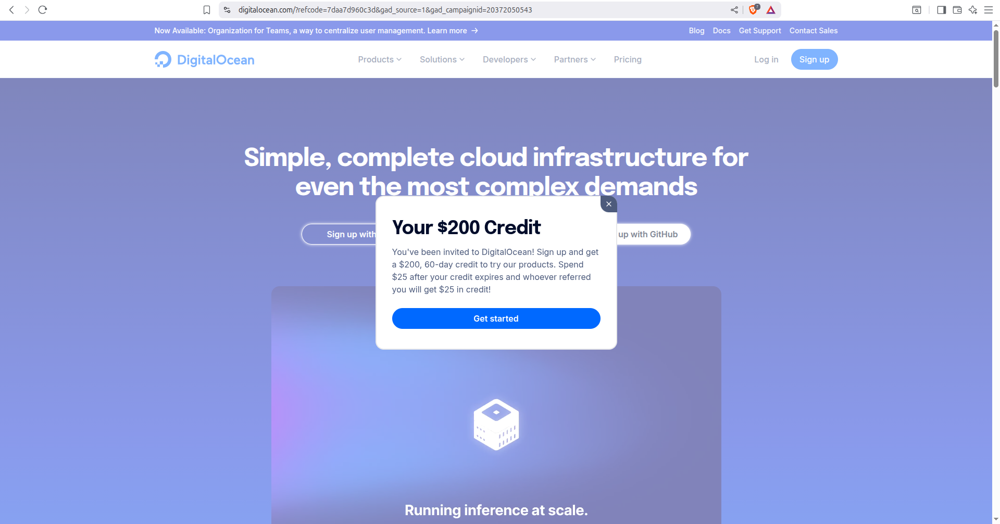</p>

### **STEP 2: Add Billing Information**
- After signing up, you will be prompted to add a **payment method**
- Insert a valid **credit card** - a **$1 verification charge** will be made (refundable)
- Upon successful verification, you will receive **$200 in free credit** to use over 60 days

<p align="center">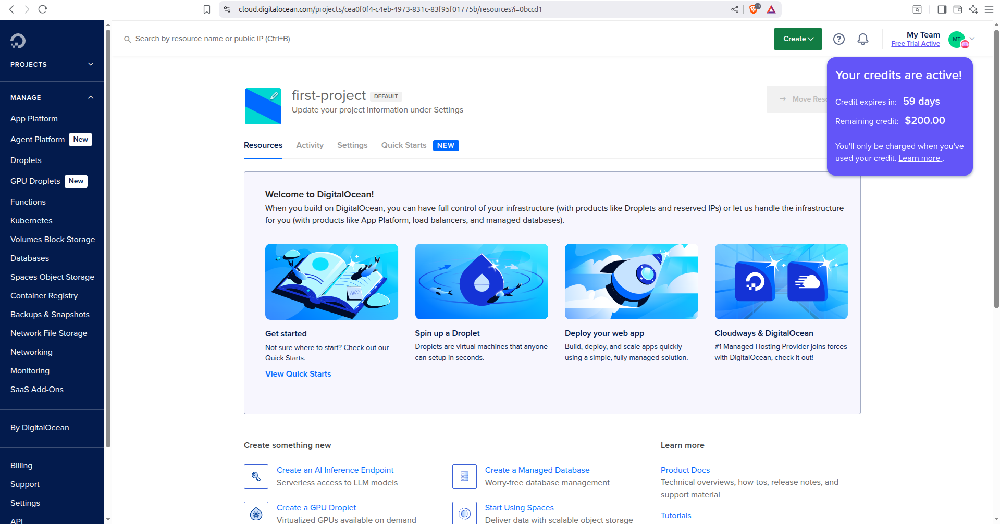</p>

### **STEP 3: Create a Project**
- DigitalOcean automatically creates **"first-project"** for you
- **Projects** help organize your resources (Droplets, volumes, etc.)
- You can use the default project or create a new one

---

## **Launching Your First Droplet (Head Node)**

In this section, you will create your first cloud server, which we will call the **"Head Node"**.

### **STEP 4: Create a Droplet**
- From your DigitalOcean control panel, click the **"Create"** button and select **"Droplets"**

<p align="center">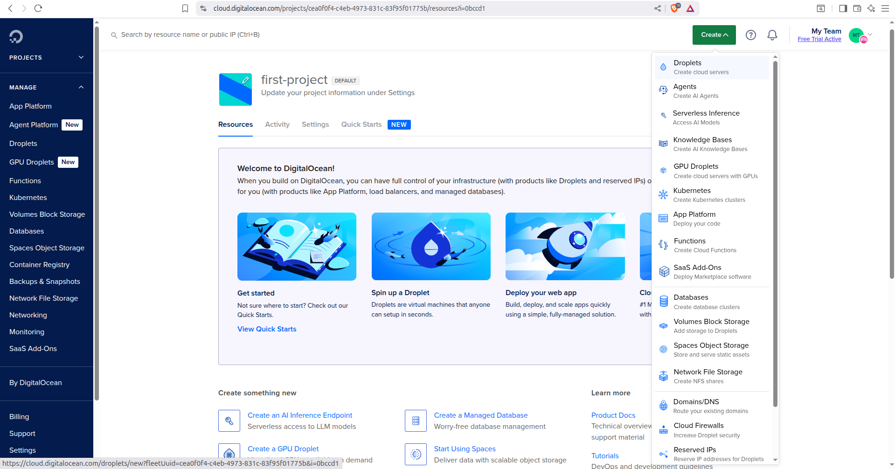</p>

#### **Configuration Options:**

**Choose an Image:**
- Select the **Distribution** tab
- Choose **Rocky Linux**
- Select the **latest version** (e.g., Rocky Linux 9.x)

<p align="center">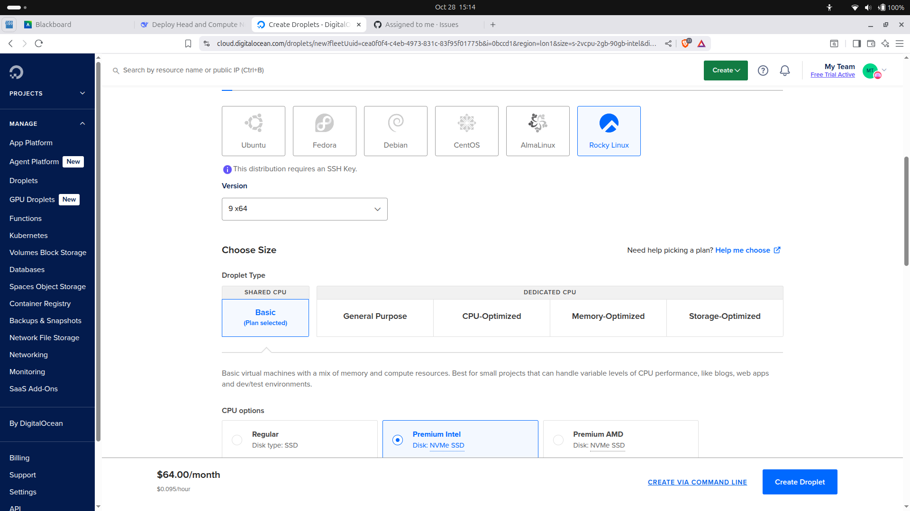</p>

**Choose a Plan:**
- Select the **Basic** plan type
- Choose the **$16/month** option (2 GB / 1 Intel CPU) - ideal for learning

<p align="center">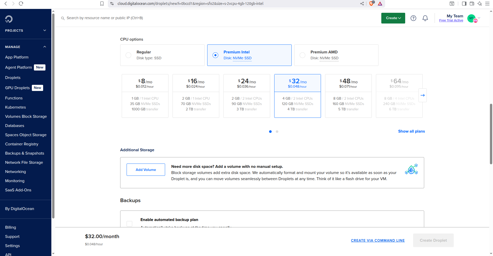</p>

**Choose a Datacenter Region:**
- Select a region **geographically close to you** (e.g., New York or San Francisco)
- This helps reduce **network latency**

**Authentication:**
- For security, select **SSH Keys**
- Use existing SSH keys or generate new ones (next step)
---

### **STEP 5: Generating an SSH Key (if you don't have one)**

You need an **SSH key** to securely connect to your Droplet.

#### **Generate SSH Key:**
**On Linux/macOS or Windows (PowerShell/WSL):**
```bash
ssh-keygen -t ed25519
```  
When prompted to "Enter file in which to save the key" - press Enter for default location.  
When prompted for a passphrase - press Enter twice (for no passphrase)  
View and Copy Public Key:  
```bash
cat ~/.ssh/id_ed25519.pub
```  
Copy the entire output (starts with ssh-ed25519...)  

**Add Key to DigitalOcean**:
- Back in the Droplet creation window, click "New SSH Key"
- Paste your public key into the text box
- Give it a descriptive name (e.g., "My Laptop Key")
- Click "Add SSH Key"

<p align="center"></p>

**Finalize the Droplet**:  
Leave all other settings at defaults (VPC Network, no block storage, no backups)
- Rename your Droplet to head
- Click "Create Droplet"

<p align="center">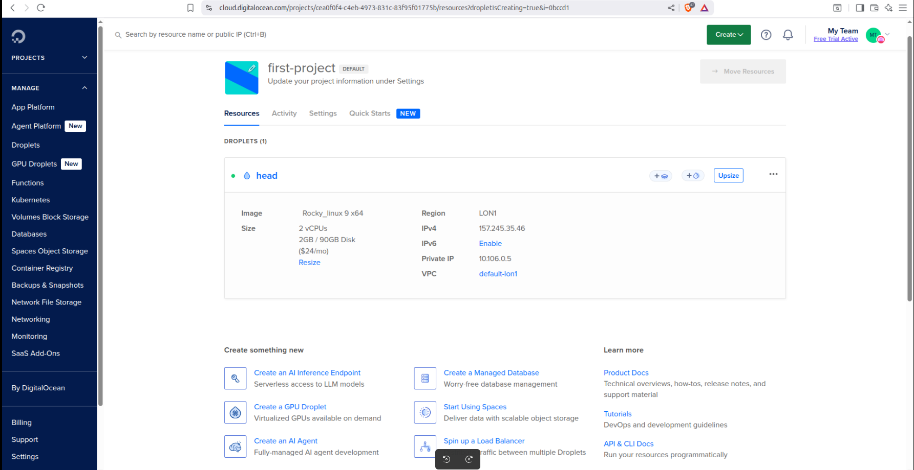</p>

**Provisioning Complete**  
Your Droplet will now provision (takes 30-60 seconds)  
You will see its public IP address once ready (e.g., 143.110.189.123)  
Your first DigitalOcean Virtual Machine is now ready! 

  
# Launching your First IBM Cloud Virtual Machine Instance

In this section, you will be configuring and launching your first **Virtual Machine (VM)** instance on IBM Cloud. This allows you to use a portion of IBM's cloud resources to host an **Operating System** as though it were running on its own dedicated hardware.

---

## **Creating Your IBM Cloud Account and Project**

### **STEP 1: Create a Free Account**
- Navigate to: **https://cloud.ibm.com/registration**
- Click **"Create an IBM Cloud Account"** and create your account using your email address

<p align="center">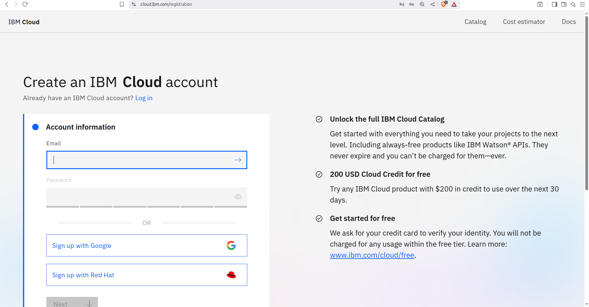</p>

### **STEP 2: Verify Your Email and Add Billing Information**
- After signing up, you will receive a verification email - enter the code to verify your account
- You will be prompted to add a **payment method** for identity verification
- Insert a valid **credit card** - a small verification charge may be made (refundable)
- Upon successful verification, you will receive **$200 in free credit** to use over 30 days

<p align="center">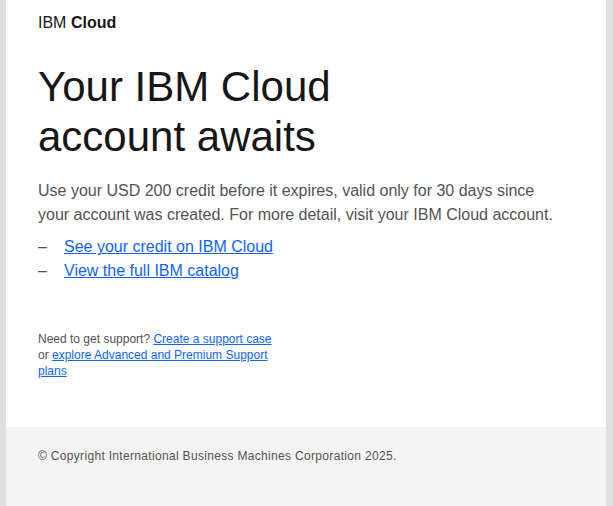</p>

### **STEP 3: Access IBM Cloud Console**
- Log in to your account at **https://cloud.ibm.com**
- You will have access to the IBM Cloud catalog with various services and Lite plans

<p align="center">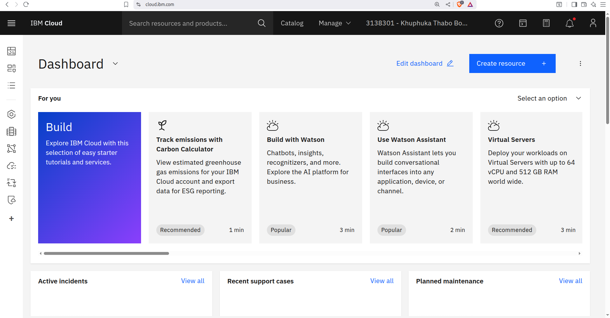</p>

---

## **Launching Your First Virtual Server Instance (Head Node)**

In this section, you will create your first cloud server, which we will call the **"Head Node"**.

### **STEP 4: Create a Virtual Server Instance**
- From your IBM Cloud dashboard, navigate to the left menu bar and click **"Infrastructure"**
- Go to **"Compute"** → **"Virtual Server Instances"**

<p align="center">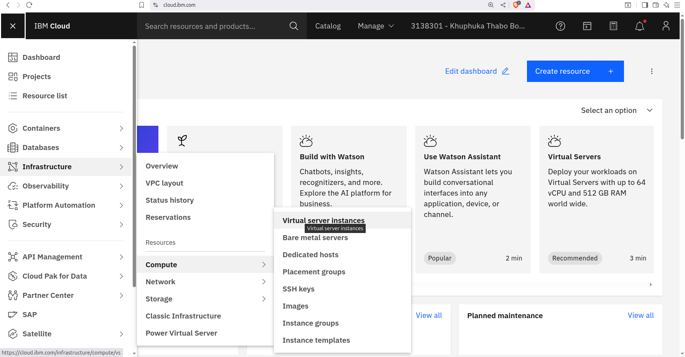</p>

#### **Configuration Options:**

**Configure Instance Basics:**
- **Instance name**: `head`
- **Resource group**: Default
- **Location**: Choose a region geographically close to you (e.g., London eu-gb)

<p align="center">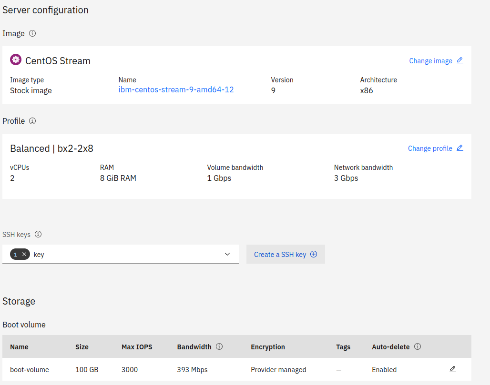</p>

**Choose an Image:**
- Select **CentOS Stream 9 - Minimal Install**
- This provides a stable, enterprise-grade Linux distribution ideal for HPC workloads

**Choose a Profile:**
- Select the **Balanced** profile type
- Choose the **bx2-2x8** option (2 vCPUs, 8GB RAM) - ideal for learning and HPC workloads

<p align="center">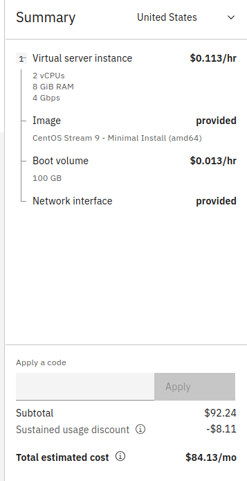</p>

**Authentication:**
- For security, configure **SSH Keys**
- Use existing SSH keys or generate new ones (next step)

---

### **STEP 5: Generating an SSH Key (if you don't have one)**

You need an **SSH key** to securely connect to your Virtual Server Instance.

#### **Generate SSH Key:**
**On Linux/macOS or Windows (PowerShell/WSL):**
```bash
ssh-keygen -t ed25519"
```
When prompted to "Enter file in which to save the key" - press Enter for default location.  
When prompted for a passphrase - press Enter twice (for no passphrase)  
View and Copy Public Key:  
```bash
cat ~/.ssh/id_ed25519.pub
```  
Copy the entire output (starts with ssh-rsa...)  

**Add Key to IBM Cloud**:
- Back in the Virtual Server creation window, under SSH keys, click "Add SSH key"
- Paste your public key into the text box
- Give it a descriptive name (e.g., "My Laptop Key")
- Click "Add SSH Key"

**Configure Storage**:
- **Boot volume**: 100GB
- **Auto-delete**: Enabled

**Finalize the Instance**:  
- Review the configuration and estimated cost (approximately $84.13/month after sustained usage discount)
- Click "Create Virtual Server Instance"

<p align="center">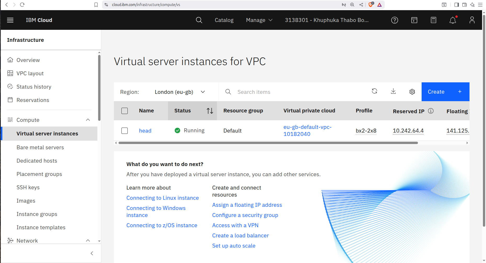</p>  

**Provisioning Complete**  
Your Virtual Server Instance will now provision (takes a few minutes)  
You will see its status change to "Running" once ready  
Your first IBM Cloud Virtual Machine is now ready! 

### **STEP 6: Reserve and Assign Floating IP**

1. **Reserve Floating IP**
   - Navigate to "Network" → "IP addresses" → "Reserve IP"
   - Reserve a new floating IP address
   - Cost: Approximately $2 per month

2. **Assign Floating IP to Head Node**
   - Go to your Virtual Server Instance details
   - Click "Attach floating IP"
   - Select the reserved floating IP
   - Confirm assignment

# Introduction to Basic Linux Administration

If you've managed to successfully build and deploy your VM instance, and you managed to successfully associate and attach a floating IP bridged over your internal interface, you are finally ready to connect to your newly created instance.

## Accessing Your Droplet via SSH MobaXTerm  
### **STEP 6: Connect to Your Head Node**  
Open a terminal on your local machine (Linux/macOS) or use PowerShell/WSL/MobaXTerm on Windows.  
Connect using the following commands.  
1. Open MobaXTerm
2. Click Session
3. Click SSH and under SSH:
    - Write public ip by ip
    - Enter username "root"
    - Under Advanced Settings add your private key  

The first time you connect, you will see a warning about the host's authenticity. Click yes and Enter.  

<p align="center">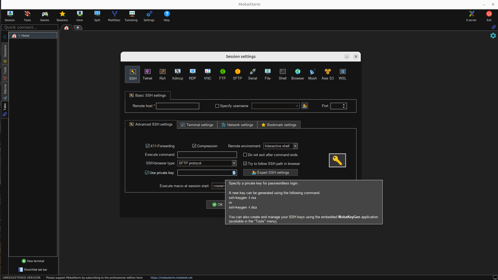</p>

Congratulations! You are now logged into your cloud-based Head Node.
  
## Accessing Your Virtual Server Instance via SSH MobaXTerm  
### **STEP 7: Connect to Your Head Node**  
Open a terminal on your local machine (Linux/macOS) or use PowerShell/WSL/MobaXTerm on Windows.  
Connect using the following commands.  

1. Open MobaXTerm
2. Click Session
3. Click SSH and under SSH:
    - Enter your floating IP address
    - Enter username "root"
    - Under Advanced Settings add your private key  

The first time you connect, you will see a warning about the host's authenticity. Click yes and Enter.  

<p align="center"></p>

Congratulations! You are now logged into your cloud-based Head Node.  

## Running Basic Linux Commands and Services

Once logged into your head node, you can now make use of the [previously discussed basic networking commands](#terminal-mobaxterm-and-windows-powershell-commands): `ip a`, `ping`, `ip route` and `tracepath`, refer to [Discussion on GitHub](https://github.com/chpc-tech-eval/scc/discussions/48) for example out, and to also post your screenshots as comments.

Here is a list of further basic Linux / Unix commands that you must familiarize yourselves and become comfortable with in order to be successful in the competition.

* Manual Pages `man`: On Linux systems, information about commands can be found in a manual page. This document is accessible via a command called `man` short term for manual page. For example, try running `man sudo`, scroll up and down then press `q` to exit the page.

* The `-h` Switch: You can make use of the `--help or -h` flag to see which options are available for a specific command. Similarly, to the above, try running `sudo -h`

* Piping and Console Redirection

  `>`  replaces the content of an output file with all input content
  `>>` appends the input content to the end of the output file.

  For example to create a file called `students.txt` and add a name to the file, use:
  ```bash
  # You can create new files using the `touch` command or the `>` redirect.
  touch students.txt
  echo "zama" >> students.txt
  echo "<TEAM_CAPTAIN>" >> students.txt
  echo "zama lecturer" >> students.txt
  echo "<TEAM_MEMBERS" >> students.txt
  ```

  Pipe `|` through `grep` can be used when searching the content of the file, if it exist it will be printed on the screen, if the search does not exist nothing will show on the screen.
  ```bash
  cat students.txt
  cat students.txt | grep "zama"
  ```

* Reading and Editing Documents: Linux systems administration essentially involves file manipulation. [Everything in a Linux is a file](https://en.wikipedia.org/wiki/Everything_is_a_file). Familiarize yourself with the basic use of `nano`.

* The GNU `history` command shows all commands you have executed so far, the feedback is numbered, use `!14` to rerun the 14th command.

Make sure that you try some of these commands to familiarize yourself and become comfortable with the Linux terminal shell and command line. You can find sample outputs and are strongly encouraged to post your teams screenshots of at least one of the above commands on the [Discussion Page on GitHub](https://github.com/chpc-tech-eval/scc/discussions/49).

* Understanding `journalctl` and `systemctl`

  Both `journalctl` and `systemctl` are two powerful command-line utilities used to manage and view system logs and services on Linux systems, respectively. Both are part of the systemd suite, which is used for system and service management.
  * `journalctl` is used to query and display logs from the journal, which is a component of systemd that provides a centralized location for logging messages generated by the `system` and services.
  * `systemctl` is used to examine and control the `systemd` system and service manager. It provides commands to start, stop, restart, enable, disable, and check the status of services, among other functionalities.

  For example to query the status of the `systemd-networkd` daemon / service, use:
  ```bash
  sudo systemctl status systemd-networkd
  ```

Verify some of your system's configuration settings and post a screenshot as a comment to this [Discussion Page on GitHub](https://github.com/chpc-tech-eval/scc/discussions/56).

> [!CAUTION]
> It is **CRITICAL** that you are always aware and sure which node or server your are working on. As you can see in the examples above, you can run *similar* commands in a Linux terminal on your workstation, on the console prompt of your head node, and as you will see later, on the console prompt of your compute node.  

# Spinning Up a Second Compute Node Using a Snapshot: Digital Ocean

This section guides you through creating a second compute node (com2) from a snapshot of your first compute node (com1). This ensures both nodes have identical configurations and pre-installed software.

## Prerequisites
- A running com1 Droplet
- Completed software installations on com1
- Access to your DigitalOcean control panel

## Step 1: Power Off com1 and Create Snapshot

1. In DigitalOcean control panel, navigate to your com1 Droplet
2. Click the "Power" dropdown menu and select "Power Off"

<p align="center">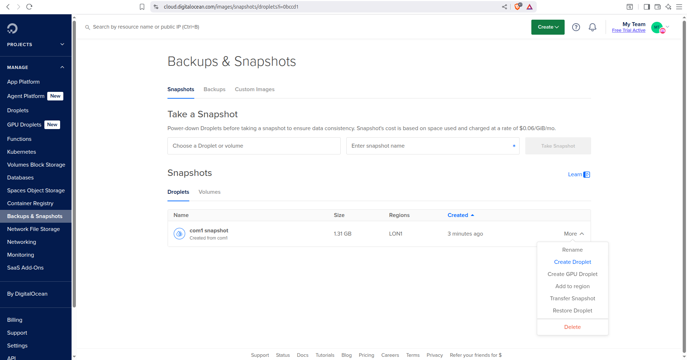</p>

3. Wait for the Droplet to fully shut down (status will show "Off")
4. Navigate to the "Snapshots" tab in your com1 Droplet management page
5. Click "Take Snapshot"
6. Enter a descriptive name: `com1-snapshot-<date>` or `compute-node-base`
7. Click "Take Snapshot"

<p align="center">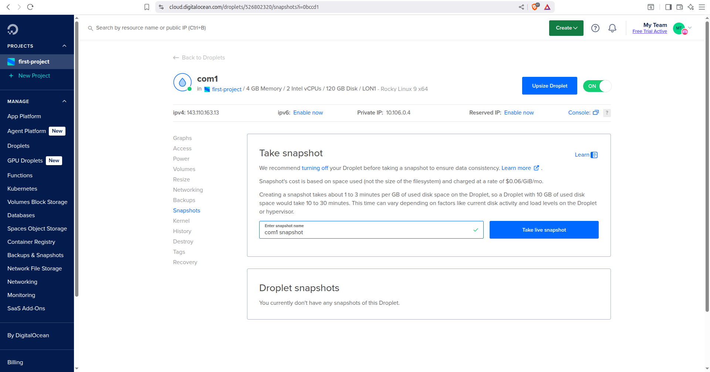</p>

## Step 2: Create com2 from Snapshot

1. Navigate to "Images" in the main DigitalOcean sidebar menu
2. Click on the "Snapshots" tab
3. Find your com1-snapshot and click the "⋮" (three dots) menu
4. Select "Create Droplet"

<p align="center">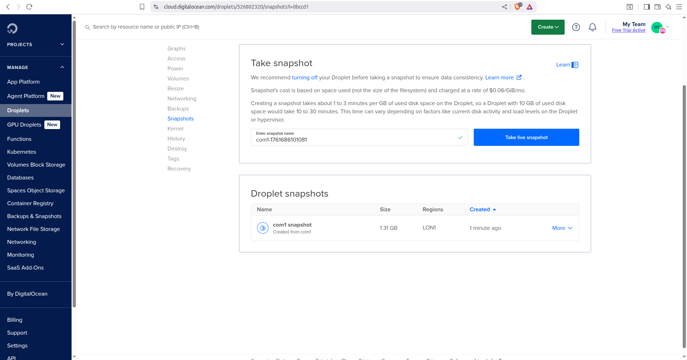</p>

## Step 3: Configure com2 Droplet

**Basic Configuration:**
- Choose an image: Your snapshot should be pre-selected
- Choose a plan: Select the same plan as com1 (e.g., Basic $16/month)
- Choose a datacenter region: Select the same region as your head node and com1

**Droplet Settings:**
- Hostname: `com2` (to distinguish from com1)
- Tags: Add `compute-node` if using tags for organization

**Authentication:**
- SSH keys: Select the same SSH key used for head node and com1

**Finalize:**
- Droplet name: `com2`
- Click "Create Droplet"

<p align="center">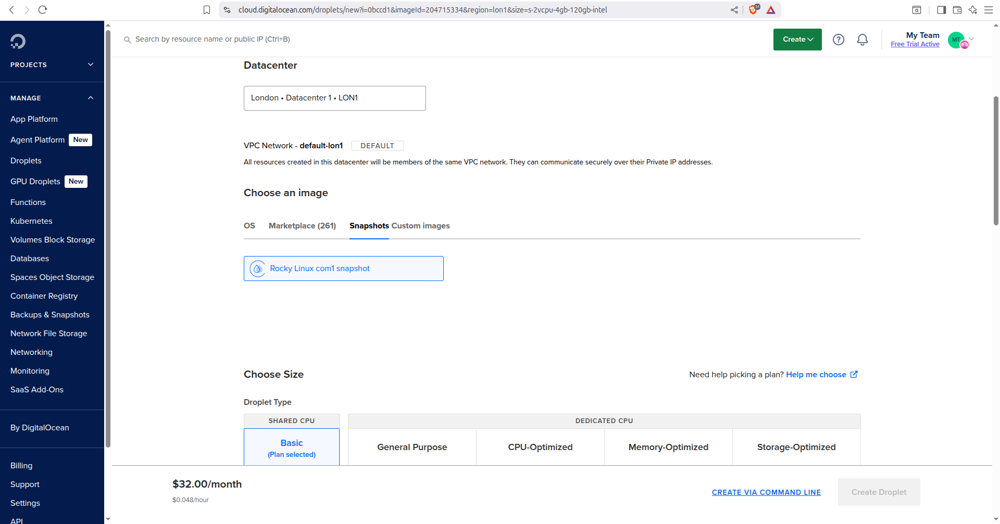</p>

## Step 4: Verify com2 Configuration

Wait for com2 to provision (typically 30-60 seconds)

<p align="center">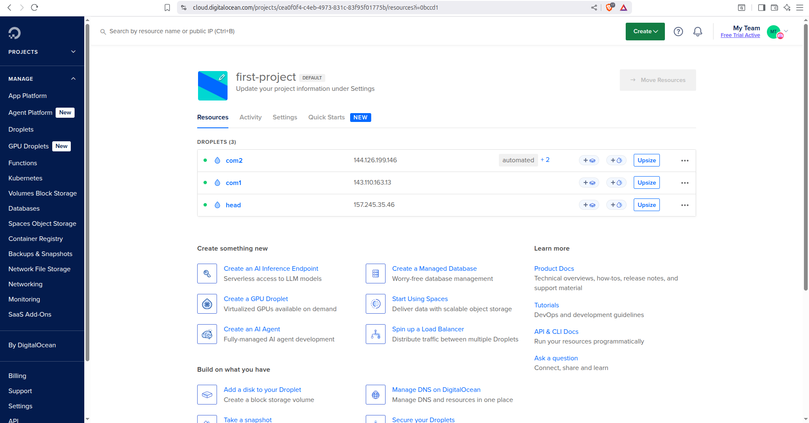</p>

Pay careful attention to the hostname, network and other configuration settings that may be specific to and may conflict with your initial node. Once your two compute nodes have been successfully deployed, are accessible from the head node and added to your MPI `hosts` file, you can continue with running HPL across multiple nodes.

# Spinning Up a Second Compute Node Using a Snapshot: IBM Cloud

This section guides you through creating a second compute node (`com2`) from a snapshot of your first compute node (`com1`). This ensures identical configurations and pre-installed software across nodes without the need for manual reconfiguration.

## Prerequisites
- Running `com1` Virtual Server Instance with configured software
- Access to IBM Cloud console
- Basic understanding of snapshot functionality

## Step-by-Step Instructions

### Step 1: Create Snapshot from com1

1. **Navigate to Block Storage Snapshots**
   - From the left menu bar, click "Infrastructure"
   - Go to "Storage" → "Block Storage Snapshots"

<p align="center">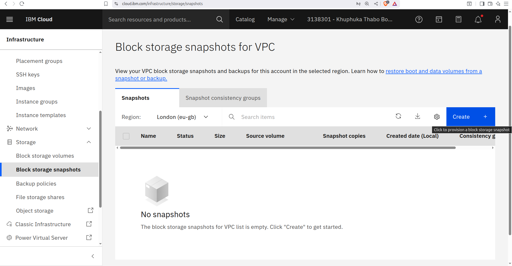</p>

2. **Create New Snapshot**
   - Click "Create" button
   - Configure the snapshot:
     - **Snapshot name**: `com1-snapshot-<date>` or `compute-node-base`
     - **Source volume**: Select the boot volume from your com1 instance
     - **Resource group**: Default
     - **Tags**: Optional tags for organization

<p align="center">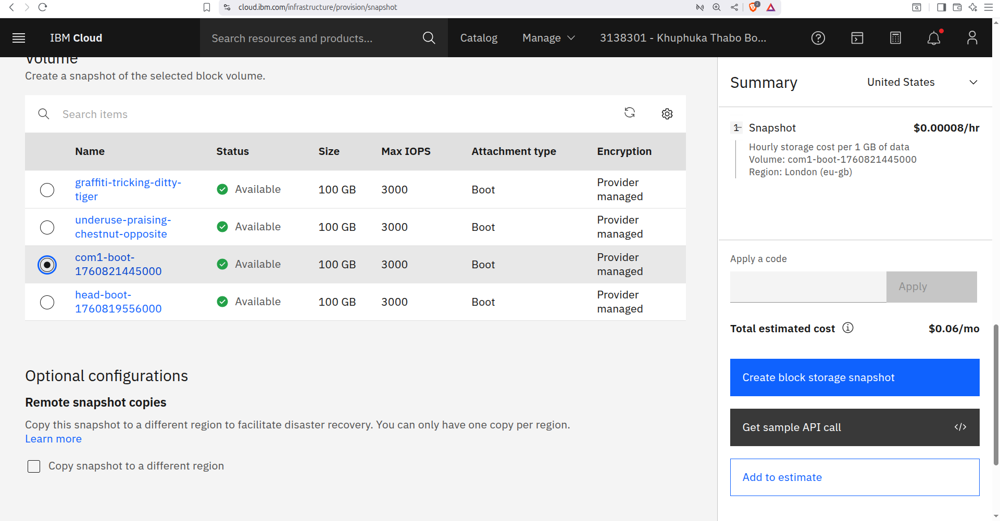</p>

3. **Initiate Snapshot Creation**
   - Review snapshot details
   - Click "Create snapshot"
   - Wait for snapshot creation to complete (status: "Available")

<p align="center">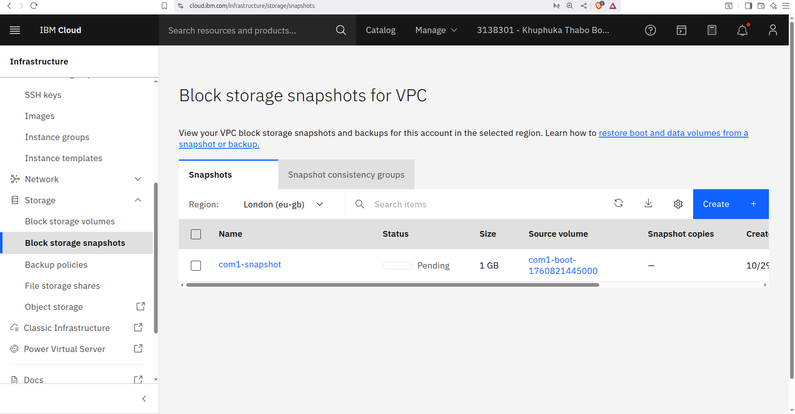</p>

### Step 2: Create com2 from Snapshot

1. **Create Instance from Snapshot**
   - From the snapshots list, find your `com1-snapshot`
   - Click the action menu (⋮) and select "Create virtual server instance"

2. **Configure com2 Instance**
   - **Instance name**: `com2`
   - **Resource group**: Default
   - **Location**: Same region as com1 (eu-gb London)
   - **Image**: Your snapshot should be pre-selected
   - **Profile**: Same as com1 (bx2-2x8 - 2 vCPUs, 8GB RAM)

<p align="center">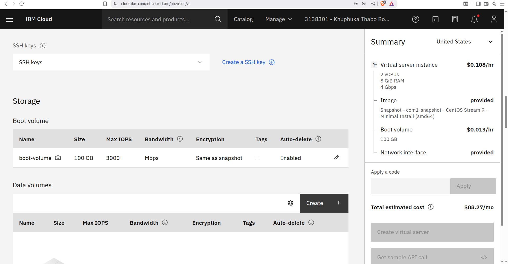</p>

3. **Network and Security**
   - **VPC**: Default VPC (same as com1)
   - **Subnet**: Same subnet as com1 for internal communication
   - **SSH keys**: Select the same SSH key used for com1
   - **No floating IP**: Keep compute nodes on private network only

4. **Review and Create**
   - Review the configuration summary
   - Click "Create virtual server" to deploy com2

### Step 3: Verify com2 Configuration

1. **Monitor Deployment**
   - Wait for com2 instance to become active (status: "Running")
   - Verify no floating IP is assigned (security best practice)

<p align="center"></p>

Congratulations! You have successfully created a second compute node from snapshot on IBM Cloud.  

# Automating the Deployment of your DigitalOcean Instances Using Terraform and GitHub Actions

This section guides you through setting up a complete Infrastructure as Code (IaC) pipeline using Terraform and GitHub Actions to automate the deployment of compute nodes on DigitalOcean.

## Architecture Overview
```
GitHub Repository → GitHub Actions → Terraform → DigitalOcean API → New Droplet
```

## Prerequisites
- DigitalOcean account with API token
- Existing `head` and `com1` droplets running
- GitHub account
- Basic familiarity with Terraform and YAML

## Step 1: Repository Structure Setup

### Create Project Directory
```bash
mkdir digital-ocean-deploy-compute-node-clean
cd digital-ocean-deploy-compute-node-clean
```

### Project Structure
```
digital-ocean-deploy-compute-node-clean/
├── terraform/
│   ├── main.tf
│   ├── variables.tf
│   ├── terraform.tfvars
│   ├── terraform.tfvars.example
│   ├── inventory.tpl
│   └── ssh_key.pub
├── ansible/
│   ├── playbook-com2.yml
│   ├── setup-com2-first.yml
│   ├── fix-nfs-mount.yml
│   ├── fix-final.yml
│   ├── inventory.ini
│   ├── inventory_static.ini
│   ├── group_vars/all.yml
│   └── ci-verification.sh
└── .github/workflows/
    └── deploy-compute-node.yml
```

## Step 2: Terraform Configuration

### Create Terraform Variables (variables.tf)
```hcl
variable "do_token" {
  description = "DigitalOcean API token"
  type        = string
  sensitive   = true
}

variable "region" {
  description = "DigitalOcean region"
  type        = string
  default     = "lon1"
}

variable "cluster_name" {
  description = "Name of the cluster"
  type        = string
  default     = "student-cluster"
}

variable "com2_size" {
  description = "Size for com2 node"
  type        = string
  default     = "s-2vcpu-4gb"
}

variable "image" {
  description = "Droplet image"
  type        = string
  default     = "rockylinux-9-x64"
}

variable "private_key_path" {
  description = "Path to the private key file"
  type        = string
}

variable "tags" {
  description = "Tags for droplets"
  type        = list(string)
  default     = ["github-actions", "hpc-cluster", "automated"]
}

variable "existing_droplet_names" {
  description = "Names of existing droplets (head and com1)"
  type        = list(string)
  default     = ["head", "com1"]
}
```

### Create Main Terraform Configuration (main.tf)
```hcl
terraform {
  required_providers {
    digitalocean = {
      source = "digitalocean/digitalocean"
      version = "~> 2.0"
    }
    local = {
      source = "hashicorp/local"
      version = "~> 2.0"
    }
  }
}

provider "digitalocean" {
  token = var.do_token
}

# Data sources to get existing droplets
data "digitalocean_droplet" "existing_nodes" {
  count = length(var.existing_droplet_names)
  name  = var.existing_droplet_names[count.index]
}

# SSH key resource
resource "digitalocean_ssh_key" "cluster_key" {
  name       = "${var.cluster_name}-key"
  public_key = file("${var.private_key_path}.pub")
}

# Create com2 droplet only
resource "digitalocean_droplet" "com2" {
  image    = var.image
  name     = "com2"
  region   = var.region
  size     = var.com2_size
  ssh_keys = [digitalocean_ssh_key.cluster_key.fingerprint]
  tags     = var.tags
}

# Generate Ansible inventory
resource "local_file" "ansible_inventory" {
  filename = "../ansible/inventory.ini"
  content = templatefile("${path.module}/inventory.tpl", {
    head_ip = data.digitalocean_droplet.existing_nodes[0].ipv4_address
    com1_ip = data.digitalocean_droplet.existing_nodes[1].ipv4_address
    com2_ip = digitalocean_droplet.com2.ipv4_address
  })
  depends_on = [digitalocean_droplet.com2]
}

output "head_ip" {
  value = data.digitalocean_droplet.existing_nodes[0].ipv4_address
}

output "com1_ip" {
  value = data.digitalocean_droplet.existing_nodes[1].ipv4_address
}

output "com2_ip" {
  value = digitalocean_droplet.com2.ipv4_address
}
```

### Create Inventory Template (inventory.tpl)
```ini
[head]
${head_ip}

[com1]
${com1_ip}

[com2]
${com2_ip}

[compute_nodes]
${com1_ip}
${com2_ip}

[all:vars]
ansible_user=root
ansible_ssh_private_key_file=/tmp/ssh_key
ansible_ssh_common_args='-o StrictHostKeyChecking=no'
```

## Step 3: Ansible Configuration

### Create Initial Setup Playbook (ansible/setup-com2-first.yml)
```yaml
---
- name: Initial setup for com2
  hosts: compute_new
  gather_facts: yes
  become: yes

  tasks:
    - name: Wait for system to be fully ready
      wait_for_connection:
        timeout: 300

    - name: Create clusteradmin user
      user:
        name: clusteradmin
        state: present
        groups: wheel
        append: yes
        create_home: yes
        shell: /bin/bash

    - name: Set password for clusteradmin
      user:
        name: clusteradmin
        password: "{{ 'clusteradmin123' | password_hash('sha512') }}"

    - name: Configure sudo for clusteradmin
      copy:
        content: "clusteradmin ALL=(ALL) NOPASSWD:ALL"
        dest: /etc/sudoers.d/clusteradmin
        mode: 0440

    - name: Create .ssh directory for clusteradmin
      file:
        path: /home/clusteradmin/.ssh
        state: directory
        owner: clusteradmin
        group: clusteradmin
        mode: 0700

    - name: Setup SSH key for clusteradmin
      copy:
        content: "{{ lookup('file', '/tmp/ssh_key.pub') }}"
        dest: /home/clusteradmin/.ssh/authorized_keys
        owner: clusteradmin
        group: clusteradmin
        mode: 0600

    - name: Configure /etc/hosts for cluster
      blockinfile:
        path: /etc/hosts
        block: |
          10.106.0.5 head
          10.106.0.4 com1
          {{ ansible_default_ipv4.address }} com2
        marker: "# {mark} ANSIBLE MANAGED BLOCK - CLUSTER NODES"

    - name: Set hostname to com2
      hostname:
        name: com2

    - name: Ensure SSH service is running
      systemd:
        name: sshd
        state: started
        enabled: yes
```

### Create Main Configuration Playbook (ansible/playbook-com2.yml)
```yaml
---
- name: Configure com2 node and integrate with cluster
  hosts: compute
  gather_facts: yes
  become: yes
  vars:
    cluster_user: "clusteradmin"

  tasks:
    - name: Wait for connection
      wait_for_connection:
        timeout: 60

    - name: Configure /etc/hosts for cluster
      blockinfile:
        path: /etc/hosts
        block: |
          10.106.0.5 head
          10.106.0.4 com1
          10.106.0.3 com2
        marker: "# {mark} ANSIBLE MANAGED BLOCK - CLUSTER NODES"

    - name: Install base packages
      package:
        name:
          - nftables
          - nfs-utils
          - chrony
          - openssh-clients
        state: present

    - name: Stop and mask firewalld
      systemd:
        name: firewalld
        state: stopped
        enabled: no
        masked: yes
      ignore_errors: yes

    - name: Set SELinux boolean for NFS home dirs
      seboolean:
        name: use_nfs_home_dirs
        state: yes
        persistent: yes

    - name: Configure NFS client
      block:
        - name: Mount NFS home directory
          mount:
            path: /home
            src: "head:/home"
            fstype: nfs
            state: mounted
            opts: defaults,_netdev
```

## Step 4: GitHub Actions Workflow

### Create Deployment Workflow (.github/workflows/deploy-compute-node.yml)
```yaml
name: Deploy Compute Node

on:
  push:
    branches: [ main ]

env:
  TERRAFORM_VERSION: 1.5.7

jobs:
  deploy:
    runs-on: ubuntu-22.04

    steps:
    - name: Checkout code
      uses: actions/checkout@v4

    - name: Setup Terraform
      uses: hashicorp/setup-terraform@v2
      with:
        terraform_version: ${{ env.TERRAFORM_VERSION }}

    - name: Install dependencies
      run: |
        sudo apt-get update
        sudo apt-get install -y sshpass

    - name: Generate SSH key pair
      run: |
        mkdir -p /tmp/.ssh
        ssh-keygen -t rsa -b 4096 -f /tmp/ssh_key -N "" -C "github-actions-cluster"

    - name: Create terraform.tfvars from secrets
      run: |
        echo 'do_token = "${{ secrets.DIGITALOCEAN_TOKEN }}"' > terraform/terraform.tfvars
        echo 'region = "lon1"' >> terraform/terraform.tfvars
        echo 'cluster_name = "student-cluster"' >> terraform/terraform.tfvars
        echo 'com2_size = "s-2vcpu-4gb"' >> terraform/terraform.tfvars
        echo 'image = "rockylinux-9-x64"' >> terraform/terraform.tfvars
        echo 'private_key_path = "/tmp/ssh_key"' >> terraform/terraform.tfvars
        echo 'tags = ["github-actions", "hpc-cluster", "automated"]' >> terraform/terraform.tfvars
        echo 'existing_droplet_names = ["head", "com1"]' >> terraform/terraform.tfvars

    - name: Setup SSH key for Terraform
      run: |
        cp /tmp/ssh_key.pub terraform/ssh_key.pub
        chmod 600 /tmp/ssh_key

    - name: Terraform Init and Apply
      run: |
        cd terraform
        terraform init
        terraform plan
        timeout 180s terraform apply -auto-approve

    - name: Wait for com2 to be ready
      run: |
        echo "Waiting for com2 droplet to be fully provisioned..."
        sleep 90

    - name: Get com2 IP using simple method
      run: |
        cd terraform
        terraform output com2_ip > ip.txt
        COM2_IP=$(grep -o '[0-9]\+\.[0-9]\+\.[0-9]\+\.[0-9]\+' ip.txt | head -1)
        echo "COM2_IP=$COM2_IP" >> $GITHUB_ENV
        echo "Com2 IP: $COM2_IP"

    - name: Configure com2 with basic setup
      run: |
        echo "Configuring com2 at $COM2_IP"
        ssh -o StrictHostKeyChecking=no -o ConnectTimeout=30 -i /tmp/ssh_key root@$COM2_IP "adduser clusteradmin"
        ssh -o StrictHostKeyChecking=no -i /tmp/ssh_key root@$COM2_IP "echo '!Super@4' | passwd --stdin clusteradmin"
        ssh -o StrictHostKeyChecking=no -i /tmp/ssh_key root@$COM2_IP "dnf install sudo -y"
        ssh -o StrictHostKeyChecking=no -i /tmp/ssh_key root@$COM2_IP "usermod -aG wheel clusteradmin"
        ssh -o StrictHostKeyChecking=no -i /tmp/ssh_key root@$COM2_IP "echo 'clusteradmin ALL=(ALL) NOPASSWD:ALL' | tee /etc/sudoers.d/clusteradmin"

    - name: Setup NFS on com2
      run: |
        echo "Setting up NFS on com2 at $COM2_IP"
        ssh -o StrictHostKeyChecking=no -i /tmp/ssh_key root@$COM2_IP "dnf install nfs-utils -y"
        ssh -o StrictHostKeyChecking=no -i /tmp/ssh_key root@$COM2_IP "mount -t nfs 10.106.0.5:/home /home"
        ssh -o StrictHostKeyChecking=no -i /tmp/ssh_key root@$COM2_IP "echo '10.106.0.5:/home /home nfs defaults 0 0' >> /etc/fstab"
        ssh -o StrictHostKeyChecking=no -i /tmp/ssh_key root@$COM2_IP "setsebool -P use_nfs_home_dirs 1"

    - name: Display completion message
      run: |
        echo "=========================================="
        echo " DEPLOYMENT COMPLETE"
        echo "=========================================="
        echo "com2 node: $COM2_IP"
        echo "User: clusteradmin"
        echo "Password: !Super@4"
        echo "NFS: Mounted /home from head node"
        echo ""
        echo "To connect: ssh clusteradmin@$COM2_IP"
        echo "=========================================="
```

## Step 5: GitHub Repository Setup

### Create Public Repository
1. Go to GitHub.com and create a new public repository
2. Name it `digital-ocean-deploy-compute-node`
3. Add team members as collaborators

<p align="center">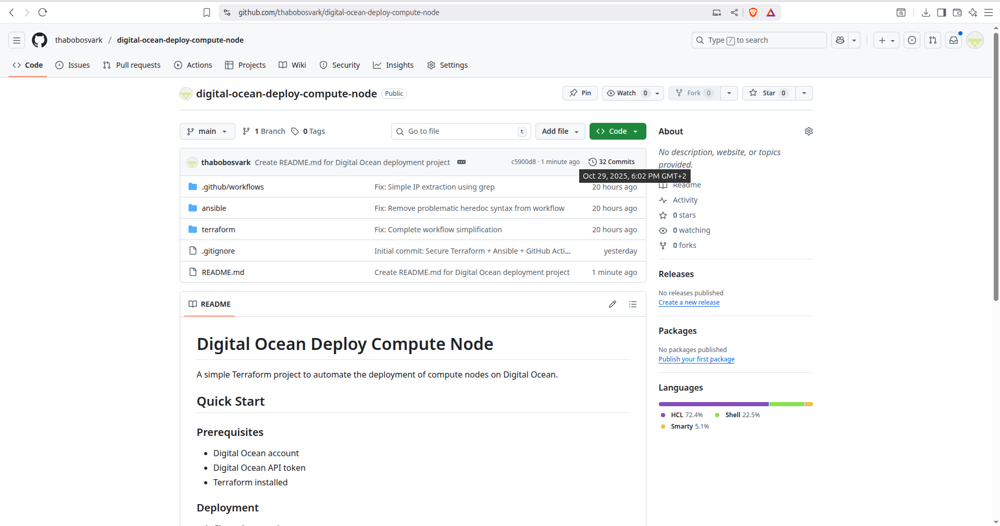</p>

### Initialize and Push Code
```bash
git init
git add .
git commit -m "Initial commit: Terraform + Ansible + GitHub Actions deployment"
git branch -M main
git remote add origin git@github.com:your-username/digital-ocean-deploy-compute-node.git
git push -u origin main
```

## Step 6: Configure GitHub Secrets

### Add Required Secrets
1. **DIGITALOCEAN_TOKEN**: Your DigitalOcean API token
2. **SSH_PRIVATE_KEY**: The private key for cluster access

**Steps to add secrets:**
1. Go to your GitHub repository
2. Navigate to **Settings** → **Secrets and variables** → **Actions**
3. Click **New repository secret**

<p align="center">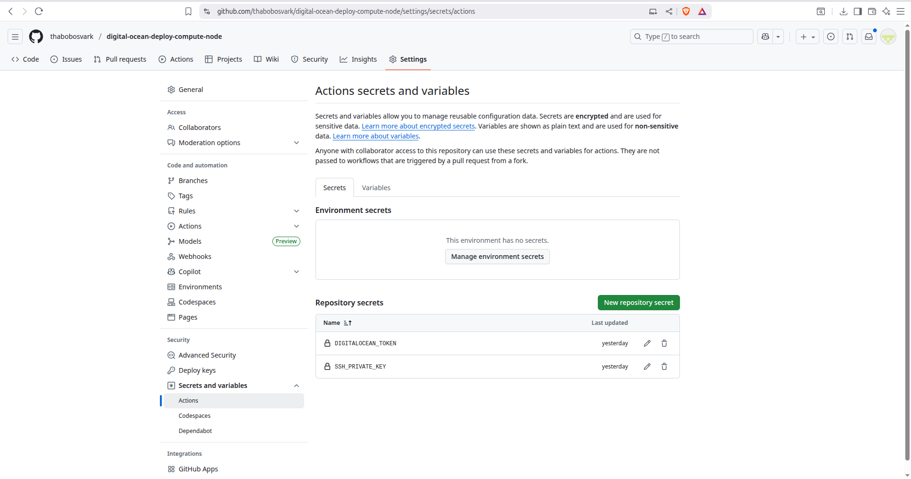</p>

## Step 7: Trigger Deployment

### Manual Trigger
1. Make a small change to any file (e.g., update README.md)
2. Commit and push changes:
```bash
git add .
git commit -m "Trigger deployment"
git push origin main
```

### Monitor Deployment
1. Go to your GitHub repository
2. Click on **Actions** tab
3. Monitor the workflow execution

<p align="center">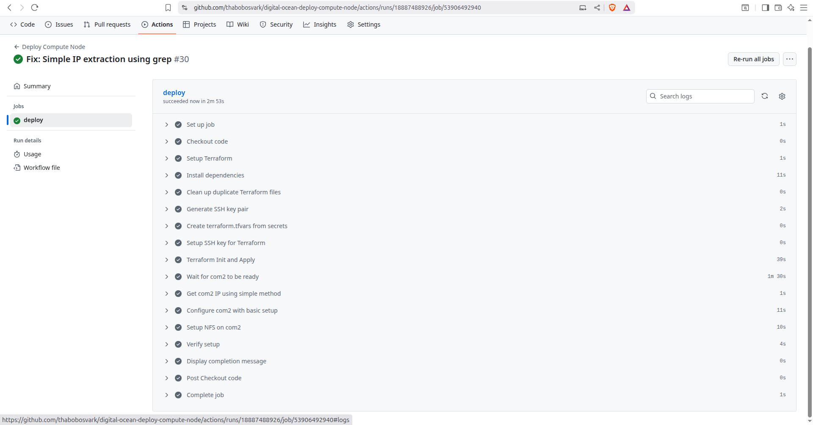</p>

### Verify Deployment
Once the GitHub Actions workflow completes successfully, verify that your new com2 node has been deployed:

<p align="center">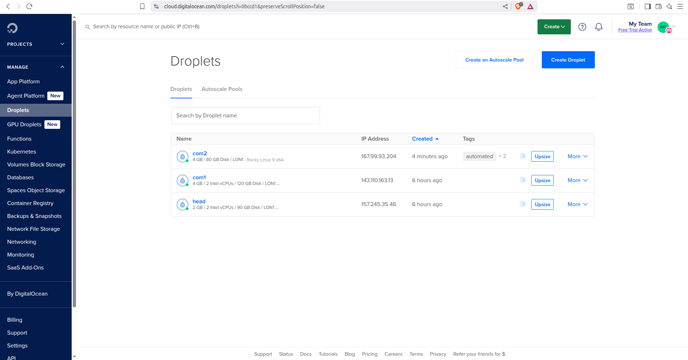</p>

> [!TIP]
> If you need to test the deployment process again, you can destroy the existing com2 node first:

<p align="center">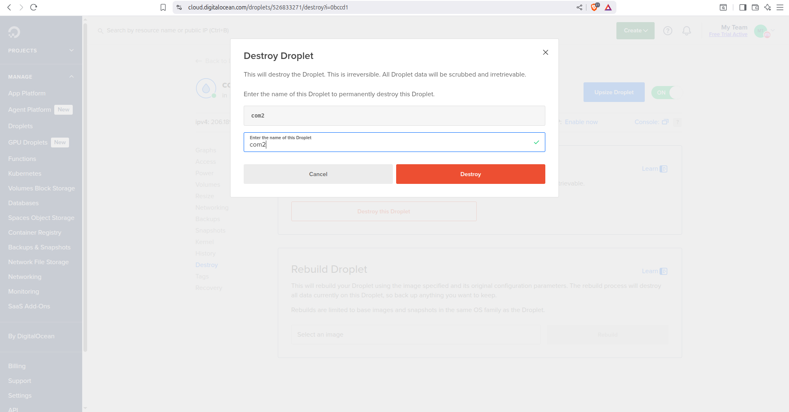</p>  

# Automating the Deployment of your IBM Cloud Instances Using Terraform

This section guides you through setting up a complete Infrastructure as Code (IaC) pipeline using Terraform to automate the deployment of compute nodes on IBM Cloud.

## Architecture Overview
```
GitHub Repository → GitHub Actions → Terraform → IBM Cloud API 
```

## Prerequisites
- IBM Cloud account with API key
- Existing `head` and `com1` virtual server instances running
- GitHub account
- Basic familiarity with Terraform and YAML

## Step 1: Repository Structure Setup

### Create Project Directory
```bash
mkdir ibm-cloud-deploy-compute-node
cd ibm-cloud-deploy-compute-node
```

### Project Structure
```
ibm-cloud-deploy-compute-node/
├── terraform/
│   ├── main.tf
│   ├── variables.tf
│   ├── terraform.tfvars
│   ├── terraform.tfvars.example
│   └── inventory.tpl
├── ansible/
│   ├── playbook-com3.yml
│   ├── setup-com3-first.yml
│   ├── inventory.ini
│   └── group_vars/all.yml
└── .github/workflows/
    └── deploy-compute-node.yml
```

## Step 2: Terraform Configuration

### Create Terraform Variables (variables.tf)
```hcl
variable "ibmcloud_api_key" {
  description = "IBM Cloud API key"
  type        = string
  sensitive   = true
}

variable "region" {
  description = "IBM Cloud region"
  type        = string
  default     = "eu-gb"
}

variable "cluster_name" {
  description = "Name of the cluster"
  type        = string
  default     = "student-cluster"
}

variable "com3_profile" {
  description = "Instance profile for com3 node"
  type        = string
  default     = "bx2-2x8"
}

variable "image_id" {
  description = "VSI image ID"
  type        = string
  default     = "r018-8aac48f7-8a92-4fe4-a7dc-a7adce4b1656"
}

variable "ssh_key_id" {
  description = "SSH key ID"
  type        = string
  default     = "r018-0882fad6-6daa-434a-9165-b3b29ae6814e"
}

variable "vpc_id" {
  description = "VPC ID"
  type        = string
  default     = "r018-7b973db6-8b1c-4b75-8126-1c68d4a396b3"
}

variable "subnet_id" {
  description = "Subnet ID"
  type        = string
  default     = "r018-7e3d817d-6aa8-46f8-8c6c-0d75e426e9a1"
}

variable "security_group_id" {
  description = "Security group ID"
  type        = string
  default     = "r018-5f4c0b6a-1e2a-4a97-9c3d-8e9f4a2b7c1e"
}

variable "zone" {
  description = "Zone"
  type        = string
  default     = "eu-gb-2"
}

variable "tags" {
  description = "Tags for instances"
  type        = list(string)
  default     = ["github-actions", "hpc-cluster", "automated"]
}
```

### Create Main Terraform Configuration (main.tf)
```hcl
terraform {
  required_providers {
    ibm = {
      source = "IBM-Cloud/ibm"
      version = "~> 1.84.3"
    }
    local = {
      source = "hashicorp/local"
      version = "~> 2.0"
    }
  }
}

provider "ibm" {
  ibmcloud_api_key = var.ibmcloud_api_key
  region           = var.region
}

# Data sources to get existing VPC resources
data "ibm_is_vpc" "existing_vpc" {
  identifier = var.vpc_id
}

data "ibm_is_subnet" "existing_subnet" {
  identifier = var.subnet_id
}

data "ibm_is_security_group" "existing_sg" {
  identifier = var.security_group_id
}

# Create com3 virtual server instance
resource "ibm_is_instance" "com3" {
  name    = "com3"
  image   = var.image_id
  profile = var.com3_profile
  keys    = [var.ssh_key_id]
  vpc     = data.ibm_is_vpc.existing_vpc.id
  zone    = var.zone
  tags    = var.tags

  primary_network_interface {
    subnet          = data.ibm_is_subnet.existing_subnet.id
    security_groups = [data.ibm_is_security_group.existing_sg.id]
  }

  timeouts {
    create = "30m"
    update = "30m"
    delete = "30m"
  }
}

# Generate Ansible inventory
resource "local_file" "ansible_inventory" {
  filename = "../ansible/inventory.ini"
  content = templatefile("${path.module}/inventory.tpl", {
    com3_private_ip = ibm_is_instance.com3.primary_network_interface[0].primary_ip[0].address
  })
  depends_on = [ibm_is_instance.com3]
}

output "com3_instance_id" {
  value = ibm_is_instance.com3.id
}

output "com3_private_ip" {
  value = ibm_is_instance.com3.primary_network_interface[0].primary_ip[0].address
}

output "com3_name" {
  value = ibm_is_instance.com3.name
}
```

### Create Inventory Template (inventory.tpl)
```ini
[head]
141.125.159.109

[com1]
10.242.64.5

[com2]
10.242.64.6

[com3]
${com3_private_ip}

[compute_nodes]
10.242.64.5
10.242.64.6
${com3_private_ip}

[all:vars]
ansible_user=clusteradmin
ansible_ssh_private_key_file=/tmp/ssh_key
ansible_ssh_common_args='-o StrictHostKeyChecking=no -o ProxyJump=clusteradmin@141.125.159.109'
```

## Step 3: Ansible Configuration

### Create Initial Setup Playbook (ansible/setup-com3-first.yml)
```yaml
---
- name: Initial setup for com3
  hosts: com3
  gather_facts: yes
  become: yes

  tasks:
    - name: Wait for system to be fully ready
      wait_for_connection:
        timeout: 300

    - name: Create clusteradmin user
      user:
        name: clusteradmin
        state: present
        groups: wheel
        append: yes
        create_home: yes
        shell: /bin/bash

    - name: Set password for clusteradmin
      user:
        name: clusteradmin
        password: "{{ '!Super@4' | password_hash('sha512') }}"

    - name: Configure sudo for clusteradmin
      copy:
        content: "clusteradmin ALL=(ALL) NOPASSWD:ALL"
        dest: /etc/sudoers.d/clusteradmin
        mode: 0440

    - name: Create .ssh directory for clusteradmin
      file:
        path: /home/clusteradmin/.ssh
        state: directory
        owner: clusteradmin
        group: clusteradmin
        mode: 0700

    - name: Setup SSH key for clusteradmin
      copy:
        content: "{{ lookup('file', '/tmp/ssh_key.pub') }}"
        dest: /home/clusteradmin/.ssh/authorized_keys
        owner: clusteradmin
        group: clusteradmin
        mode: 0600

    - name: Configure /etc/hosts for cluster
      blockinfile:
        path: /etc/hosts
        block: |
          10.242.64.4 head
          10.242.64.5 com1
          10.242.64.6 com2
          {{ ansible_default_ipv4.address }} com3
        marker: "# {mark} ANSIBLE MANAGED BLOCK - CLUSTER NODES"

    - name: Set hostname to com3
      hostname:
        name: com3

    - name: Ensure SSH service is running
      systemd:
        name: sshd
        state: started
        enabled: yes
```

### Create Main Configuration Playbook (ansible/playbook-com3.yml)
```yaml
---
- name: Configure com3 node and integrate with cluster
  hosts: com3
  gather_facts: yes
  become: yes
  vars:
    cluster_user: "clusteradmin"

  tasks:
    - name: Wait for connection
      wait_for_connection:
        timeout: 60

    - name: Install base packages
      package:
        name:
          - nfs-utils
          - chrony
          - openssh-clients
        state: present

    - name: Configure NFS client
      block:
        - name: Mount NFS home directory
          mount:
            path: /home
            src: "head:/home"
            fstype: nfs
            state: mounted
            opts: defaults,_netdev

        - name: Set SELinux boolean for NFS home dirs
          seboolean:
            name: use_nfs_home_dirs
            state: yes
            persistent: yes
```

## Step 4: GitHub Actions Workflow

### Create Deployment Workflow (.github/workflows/deploy-compute-node.yml)
```yaml
name: Deploy Compute Node

on:
  push:
    branches: [ main ]

env:
  TERRAFORM_VERSION: 1.5.7

jobs:
  deploy:
    runs-on: ubuntu-22.04

    steps:
    - name: Checkout code
      uses: actions/checkout@v4

    - name: Setup Terraform
      uses: hashicorp/setup-terraform@v2
      with:
        terraform_version: ${{ env.TERRAFORM_VERSION }}

    - name: Install dependencies
      run: |
        sudo apt-get update
        sudo apt-get install -y sshpass

    - name: Generate SSH key pair
      run: |
        mkdir -p /tmp/.ssh
        ssh-keygen -t rsa -b 4096 -f /tmp/ssh_key -N "" -C "github-actions-cluster"

    - name: Create terraform.tfvars from secrets
      run: |
        cat > terraform/terraform.tfvars << EOF
        ibmcloud_api_key = "${{ secrets.IBM_CLOUD_API_KEY }}"
        region = "eu-gb"
        cluster_name = "student-cluster"
        com3_profile = "bx2-2x8"
        image_id = "r018-8aac48f7-8a92-4fe4-a7dc-a7adce4b1656"
        ssh_key_id = "r018-0882fad6-6daa-434a-9165-b3b29ae6814e"
        vpc_id = "r018-7b973db6-8b1c-4b75-8126-1c68d4a396b3"
        subnet_id = "r018-7e3d817d-6aa8-46f8-8c6c-0d75e426e9a1"
        security_group_id = "r018-5f4c0b6a-1e2a-4a97-9c3d-8e9f4a2b7c1e"
        zone = "eu-gb-2"
        tags = ["github-actions", "hpc-cluster", "automated"]
        EOF

    - name: Setup SSH key for Terraform
      run: |
        cp /tmp/ssh_key.pub terraform/ssh_key.pub
        chmod 600 /tmp/ssh_key

    - name: Terraform Init and Apply
      run: |
        cd terraform
        terraform init
        terraform plan
        timeout 300s terraform apply -auto-approve

    - name: Wait for com3 to be ready
      run: |
        echo "Waiting for com3 instance to be fully provisioned..."
        sleep 120

    - name: Get com3 IP
      run: |
        cd terraform
        terraform output com3_private_ip > ip.txt
        COM3_IP=$(grep -o '[0-9]\+\.[0-9]\+\.[0-9]\+\.[0-9]\+' ip.txt | head -1)
        echo "COM3_IP=$COM3_IP" >> $GITHUB_ENV
        echo "Com3 Private IP: $COM3_IP"

    - name: Configure com3 with basic setup using ProxyJump
      run: |
        echo "Configuring com3 at $COM3_IP using ProxyJump through head node"
        ssh -o StrictHostKeyChecking=no -o ConnectTimeout=30 -J clusteradmin@141.125.159.109 root@$COM3_IP "adduser clusteradmin"
        ssh -o StrictHostKeyChecking=no -J clusteradmin@141.125.159.109 root@$COM3_IP "echo '!Super@4' | passwd --stdin clusteradmin"
        ssh -o StrictHostKeyChecking=no -J clusteradmin@141.125.159.109 root@$COM3_IP "dnf install sudo -y"
        ssh -o StrictHostKeyChecking=no -J clusteradmin@141.125.159.109 root@$COM3_IP "usermod -aG wheel clusteradmin"
        ssh -o StrictHostKeyChecking=no -J clusteradmin@141.125.159.109 root@$COM3_IP "echo 'clusteradmin ALL=(ALL) NOPASSWD:ALL' | tee /etc/sudoers.d/clusteradmin"
        ssh -o StrictHostKeyChecking=no -J clusteradmin@141.125.159.109 root@$COM3_IP "chmod 440 /etc/sudoers.d/clusteradmin"

    - name: Setup NFS on com3 using ProxyJump
      run: |
        echo "Setting up NFS on com3 at $COM3_IP using ProxyJump"
        ssh -o StrictHostKeyChecking=no -J clusteradmin@141.125.159.109 root@$COM3_IP "dnf install nfs-utils -y"
        ssh -o StrictHostKeyChecking=no -J clusteradmin@141.125.159.109 root@$COM3_IP "mount -t nfs 10.242.64.4:/home /home"
        ssh -o StrictHostKeyChecking=no -J clusteradmin@141.125.159.109 root@$COM3_IP "echo '10.242.64.4:/home /home nfs defaults 0 0' >> /etc/fstab"
        ssh -o StrictHostKeyChecking=no -J clusteradmin@141.125.159.109 root@$COM3_IP "setsebool -P use_nfs_home_dirs 1"

    - name: Display completion message
      run: |
        echo "=========================================="
        echo " DEPLOYMENT COMPLETE"
        echo "=========================================="
        echo "com3 node (Private): $COM3_IP"
        echo "User: clusteradmin"
        echo "Password: !Super@4"
        echo "NFS: Mounted /home from head node (10.242.64.4)"
        echo ""
        echo "To connect from your workstation:"
        echo "ssh -J clusteradmin@141.125.159.109 clusteradmin@$COM3_IP"
        echo ""
        echo "Or connect via head node:"
        echo "ssh clusteradmin@141.125.159.109"
        echo "ssh clusteradmin@$COM3_IP"
        echo "=========================================="
```

## Step 5: GitHub Repository Setup

### Create Public Repository
1. Go to GitHub.com and create a new public repository
2. Name it `ibm-cloud-deploy-compute-node`
3. Add team members as collaborators

<p align="center">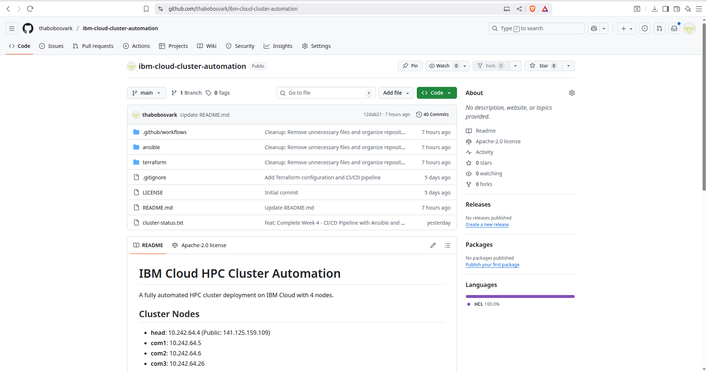</p>

### Initialize and Push Code
```bash
git init
git add .
git commit -m "Initial commit: Terraform + Ansible + GitHub Actions deployment for IBM Cloud"
git branch -M main
git remote add origin git@github.com:your-username/ibm-cloud-deploy-compute-node.git
git push -u origin main
```

## Step 6: Configure GitHub Secrets

### Add Required Secrets
1. **IBM_CLOUD_API_KEY**: Your IBM Cloud API token
2. **SSH_PRIVATE_KEY**: The private key for cluster access

**Steps to add secrets:**
1. Go to your GitHub repository
2. Navigate to **Settings** → **Secrets and variables** → **Actions**
3. Click **New repository secret**

<p align="center">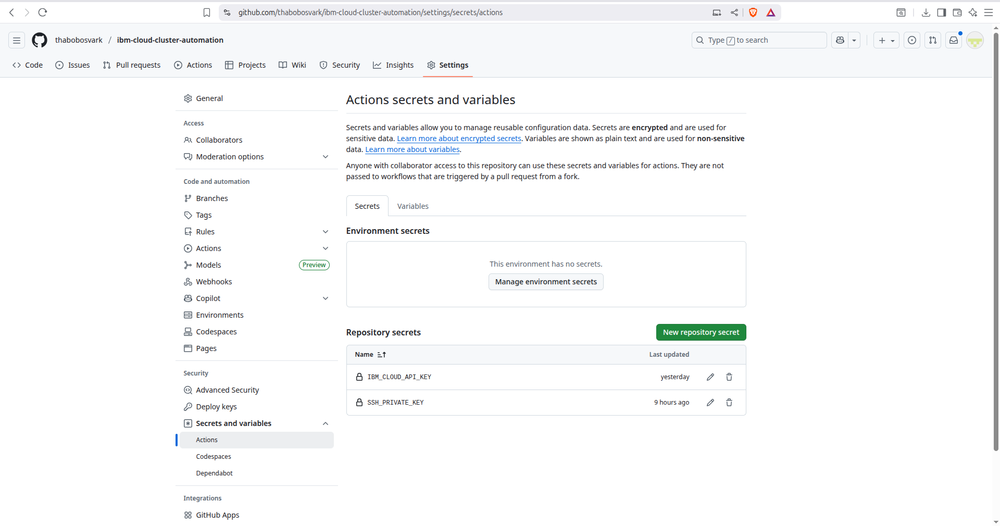</p>

## Step 7: Trigger Deployment

### Manual Trigger
1. Make a small change to any file (e.g., update README.md)
2. Commit and push changes:
```bash
git add .
git commit -m "Trigger deployment"
git push origin main
```

### Monitor Deployment
1. Go to your GitHub repository
2. Click on **Actions** tab
3. Monitor the workflow execution

<p align="center">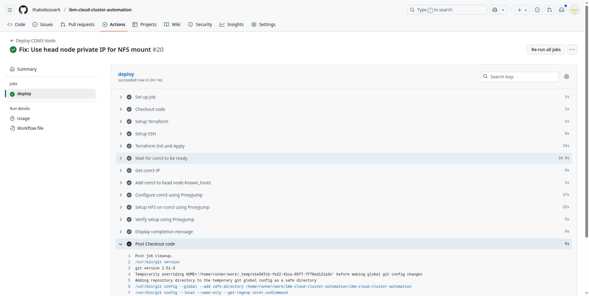</p>

### Verify Deployment
Once the GitHub Actions workflow completes successfully, verify that your new com3 node has been deployed:

<p align="center"></p>

> [!TIP]
> If you need to test the deployment process again, you can destroy the existing com3 node first by running:
```bash
cd terraform
terraform destroy -auto-approve
```

# Continuous Integration Using GitHub Actions

## Prepare GitHub Repository

1. **Create a new repository** on GitHub named `ibm-cloud-deploy-compute-node`
2. **Make it private** to protect your IBM Cloud credentials
3. **Add team members** as collaborators

## Reuse Terraform Configurations

The Terraform configurations from the previous section can be reused directly. Ensure your `main.tf` and `variables.tf` are properly configured for IBM Cloud.

## Create GitHub Actions Workflow

Create the `.github/workflows/deploy-compute-node.yml` file as shown in the previous section. This workflow will:

- Automatically deploy when code is pushed to the main branch
- Use your IBM Cloud API key from GitHub secrets
- Provision a new compute node (com3)
- Configure the node with necessary software and NFS mounts
- Integrate the node into your existing cluster

## Create CircleCI Account and Add Project (Alternative)

If you prefer to use CircleCI instead of GitHub Actions:

1. **Sign up for CircleCI** at https://circleci.com
2. **Connect your GitHub account** to CircleCI
3. **Add your project** to CircleCI
4. **Set environment variables** in CircleCI:
   - `IBM_CLOUD_API_KEY`: Your IBM Cloud API key
   - `SSH_PRIVATE_KEY`: Your SSH private key

### CircleCI Configuration (.circleci/config.yml)
```yaml
version: 2.1

jobs:
  deploy:
    docker:
      - image: cimg/base:2024.01
    steps:
      - checkout
      - run:
          name: Install Terraform
          command: |
            wget https://releases.hashicorp.com/terraform/1.5.7/terraform_1.5.7_linux_amd64.zip
            unzip terraform_1.5.7_linux_amd64.zip
            sudo mv terraform /usr/local/bin/
      - run:
          name: Terraform Init and Apply
          command: |
            cd terraform
            terraform init
            terraform apply -auto-approve -var="ibmcloud_api_key=$IBM_CLOUD_API_KEY"
      - run:
          name: Configure New Node
          command: |
            # Add configuration steps similar to GitHub Actions workflow
            echo "Configuration completed"

workflows:
  version: 2
  deploy-workflow:
    jobs:
      - deploy:
          context: ibm-cloud-context
```  

Congrats! You have completed this project walkthrough. And if there's any challenges, please contacts DcSpears @ 240427556@mycput.ac.za
