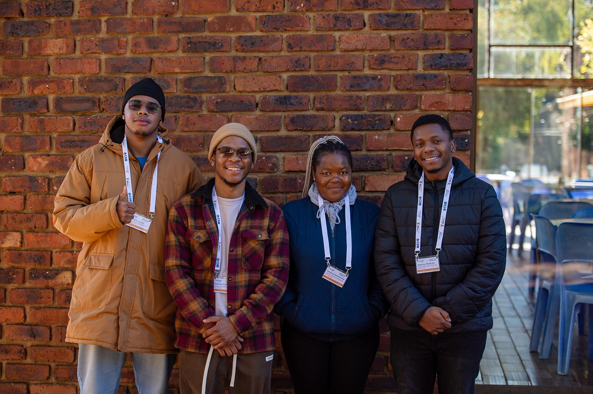

# DcSpears2025 - CHPC Student Cluster Competition 2025 PUBLIC REPO



##  Overview

This repository documents Team DC Spears' journey through the CHPC 2025 Student Cluster Competition training phase. Our project focused on designing, deploying, and automating multi-cloud High-Performance Computing (HPC) clusters using **IBM Cloud** and **DigitalOcean**, after being reassigned from Google Cloud due to credit limitations.

## Team Members

| Name | Role | Institution | Primary Responsibilities |
|------|------|-------------|--------------------------|
| **Anthony Joseph** | Team Captain & Synthetics Lead | CPUT | HPL, HPCC, HPCG, MathWorks benchmarks |
| **Thabo Bosvark** | Hardware & Infrastructure Lead | CPUT | DFTB+, Cloud automation, Terraform and Initial Cluster Setup |
| **Maanda Mulaudzi** | Environment Specialist | CPUT | ASCOT5, Lmod |
| **Tshifhiwa Netshifhefhe** | System Administrator | CPUT | AmberMD, Slurm |


## Repository Structure

```
DcSpears2025/
├── Poster/                    # Competition poster and presentations
│   └── DcSpears poster (1).pdf
├──  Project/                   # Complete project documentation
│   ├── README.md                 # Main project documentation
│   └── resources/                # Screenshots and visual assets
├──  images/                    # Team photos and logos
│   ├── CPUT_Logo.png
│   └── 140-student-cluster-02.jpg
└── README.md                     # This file
```

##  Project Repositories

###  **Main Deployment Repositories**

| Platform | Repository | Description |
|----------|------------|-------------|
| **IBM Cloud** | [thabobosvark/ibm-cloud-cluster-automation](https://github.com/thabobosvark/ibm-cloud-cluster-automation) | Complete IBM Cloud infrastructure automation with Terraform & GitHub Actions |
| **DigitalOcean** | [thabobosvark/digital-ocean-deploy-compute-node](https://github.com/thabobosvark/digital-ocean-deploy-compute-node) | DigitalOcean droplet deployment automation with CI/CD pipelines |

###  **Benchmark Repositories** (Private)
- **Synthetic Benchmarks**: HPL, HPCC, HPCG (Anthony)
- **Application Benchmarks**: 
  - ASCOT5 (Maanda)
  - AmberMD (Tshifhiwa) 
  - DFTB+ (Thabo)
  - MathWorks (Anthony)
  - HemeLB (Team)

## Technical Implementation

### **Cloud Infrastructure Automation**
- **Terraform**: Infrastructure as Code for reproducible deployments
- **Ansible**: Configuration management and node setup
- **GitHub Actions**: CI/CD pipelines for automated deployments
- **Multi-Node HPC Cluster**: Head node + compute nodes architecture

### **Key Features**
- Automated VM instance creation and configuration
- SSH key management and secure access
- Snapshot-based compute node replication
- NFS-shared home directories across cluster

##  Quick Access Links

- **[ View Our Poster](Poster/DcSpears%20poster%20(1).pdf)** - Competition presentation poster
- **[ Project Documentation](Project/README.md)** - Complete technical documentation
- **[ IBM Cloud Automation](https://github.com/thabobosvark/ibm-cloud-cluster-automation)** - IBM deployment repository
- **[ DigitalOcean Automation](https://github.com/thabobosvark/digital-ocean-deploy-compute-node)** - DigitalOcean deployment repository

##  Challenges & Lessons Learned

### **Major Challenges Overcome**
1. **Cloud Platform Migration**: Successfully migrated from GCloud to DigitalOcean due to credit issues
2. **Multi-Cloud Complexity**: Managed different APIs and workflows for IBM Cloud vs DigitalOcean
3. **Automation Pipeline**: Developed robust CI/CD pipelines for infrastructure deployment
4. **Network Configuration**: Implemented secure SSH tunnels and floating IP management

### **Key Skills Developed**
- Advanced Linux system administration
- Infrastructure as Code with Terraform
- CI/CD pipeline development with GitHub Actions
- Multi-node HPC cluster design and deployment
- Cloud cost optimization and resource management

## Technologies Used

- **Cloud Platforms**: IBM Cloud, DigitalOcean
- **Infrastructure as Code**: Terraform, Ansible
- **CI/CD**: GitHub Actions, CircleCI


## Contact
For any help understanding project, please contact DcSpears at DCSpears25@gmail.com

---

*This repository represents our team's preparation for the CHPC 2025 Student Cluster Competition. All work documented here was completed during the training phase leading up to the national competition.*
